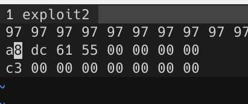
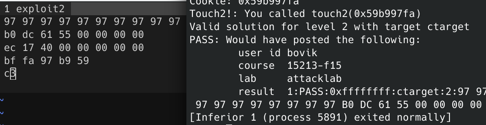
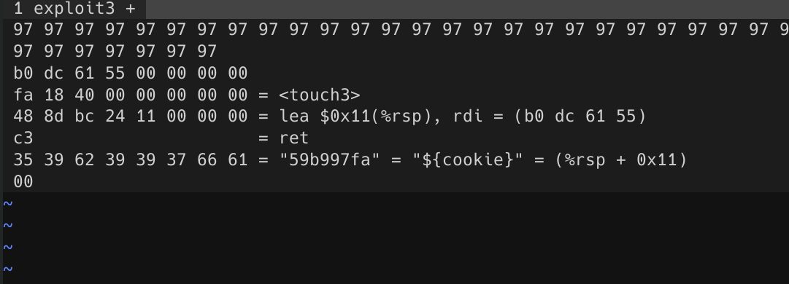

# attack lab 实验记录

## 需要准备的前置内容

其实主要就是看那个attacklab.pdf。attacklab分为两个部分，第一个部分攻击ctarget（前三题），第二部分攻击rtarget（后两题），ctarget是进行Code Injection, rtarget是进行Return Oriented Programming（面向方向）

## Ctarget: level 1

目标是让getbuf返回后执行touch1函数

这题很简单，利用的就是getbuf函数返回时（ret指令执行后）会跳转到原函数下一条指令，而跳转地址就在上一个函数的stack frame的最后，我们只需要用一些文字把40个字节的缓冲区填满，然后用touch1的指令地址覆盖原函数test下一条指令的地址。

所以我的答案就是97 * 40 (97应该是'a'吧好像)然后加上c0 17 40, 用objdump -d 或者(gdb) layout asm可以查到我文件的touch1的地址是0x4017c0，很快通过测试。

## Ctarget: level 2




一开始很难对准目标，在进入缓冲区前$rsp = 0x5561dca0, 

需要注意的是，在ret返回后跳转的地址里，读取的是8个字节（即整个rip在之前其实都已经push进去了，一开始没把握好0xa8,以为c3(ret)可以直接放在a5处，导致一直没法执行。



之后凑一凑答案就出来了。bf xx是mov $xx, %edi,就是伪造参数，之后c3是ret，会返回到文件里第三行那个0x4017ec,就是touch2的地址。

 ## Ctarget: level 3

​	要求往touch3里输入一个参数，参数是一个字符串，内容是"${cookie}"，把cookie的值换成字符串放进去，且比较的数据存放的地方是经过随机处理过的。

这道题的解决思路就是在已知位置存储cookie的字符串，然后执行`lea (cookie), rdi`传参，再ret到<touch3>，cookie的位置就在stack上，我们可以控制(cookie) = %rsp + num

答案如下图，后边等号解释得比较详细了。
把数据存在c3后面，0x11+%rsp就可以到达这个点。（什么？应该是+0x19？在getbuf()里ret到b0 dc 61 55再跳转到两行以后，这时候rsp已经在<touch3>那一行了，所以就是0x11。



至于如何知道lea语句的机器码的，手册里其实有讲。

开一个test.s文件，里边写上lea语句然后

```assembly
gcc -c test.s
objdump -d test.o
```

就能看到单个语句的机器码了。

## Rtarget: level 2

在Part II，增加了两个保护机制，一个是栈随机化，注入在栈里的可执行代码位置是无法完全确定的，所以难以ret到stack里执行；另一个保护机制是设置stack区域为non executable,即使注入成功了也无法在其中执行代码。剩下两道题采用的是return oriented programming,用的方法是利用原先文件里就存在的代码，这些代码地址是确定的，然后用ret（即0xc3）前有用的代码拼凑起来成为攻击代码。

phase 4 是要用ROP复刻phase 2的操作：把cookie的值放到%rdi里作为参数然后跳转到<touch2>

首先对照着机器码的表可以看到movq都是48 89开头，在反汇编的文件里一顿搜索就可以看出badget farm里有哪些有可能有用的，首先看到的是48 89 c7 c3（`mov %rax, %rdi` +  `ret`)，那我只要再找到一个把cookie数据放到%rax的操作就ok了。

显然，cookie的数据应该是注入在stack overflow里的，一开始想的是`mov %rsp, %rax` + `pop xxx`这样的，但是找不到相应的机器码，后面想到了可以直接用`pop %rax`就可以了，然后也确实有这个语句，所以就完美解决了，一次通过。

组织起来，在stack overflow的区域：

```
--这里是栈顶--
to {pop %rax} 执行该代码时rsp已经指向cookie了,pop后rsp指向第三行，能顺利地跳转到rax->rdi的指令
cookie
to {mov %rax, %rdi}
to <touch2>
--上面是开始溢出的地方--
```

## Rtarget: level 3

目标是复刻phase 3,非常坑，有一个画风奇特的badget,名字叫<add_xy>，作用是%rdi+%rsi-> %rax,可以直接用，而不是截取一半，下面的表从下往上分析，用vim的/查找，可以拉出一串传递链出来，应该不太难理解。

除此之外在指南里还附带了两字节没卵用机器码，和0x90是等效的，也会用的上。

```
--栈顶--
mov %rsp, %rax
mov %rax, %rdi
pop %rax
offset
mov %eax, %edx
mov %edx, %ecx
mov %ecx, %esi
add %rdi, %rsi -> %rax
mov %rax, %rdi
to <touch3>
cookie
```

```
06 1a 40 00 00 00 00 00
a2 19 40 00 00 00 00 00
ab 19 40 00 00 00 00 00
48 00 00 00 00 00 00 00
dd 19 40 00 00 00 00 00
34 1a 40 00 00 00 00 00
27 1a 40 00 00 00 00 00
d6 19 40 00 00 00 00 00
a2 19 40 00 00 00 00 00
fa 18 40 00 00 00 00 00
35 39 62 39 39 37 66 61
00 
```

## Fin

一共花了一天半时间做这个，大概在7h左右吧应该，其实前四个难度都不是很大，最后一个是真的挺难的，这个实验非常好玩，而且学到的东西挺多的，自己一边看指南一边执行自己注入的exploit真的很爽，这个pdf好像写得很通俗，看的时候非常流畅，而且提示还挺多的，不乏为有效的操作指北。