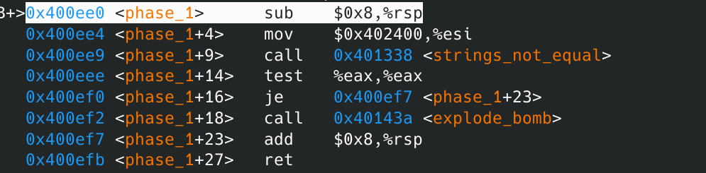
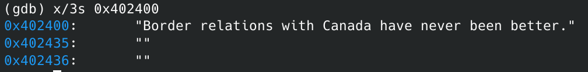
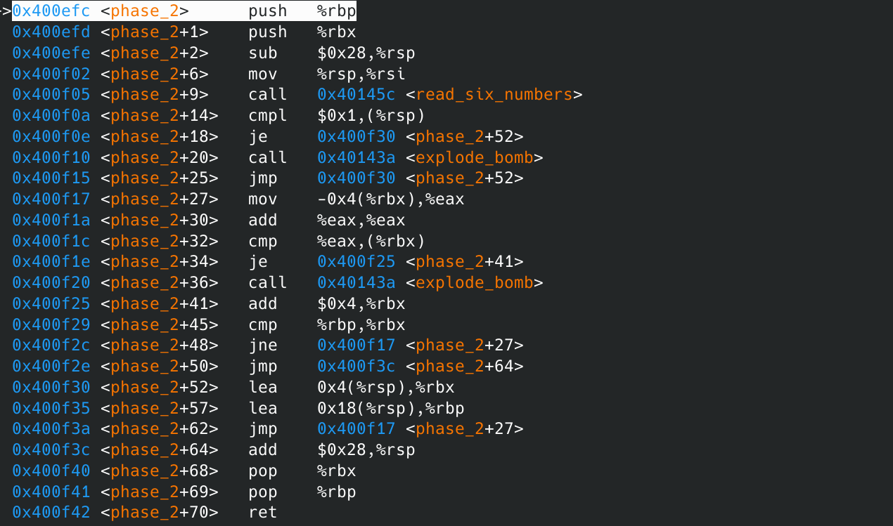
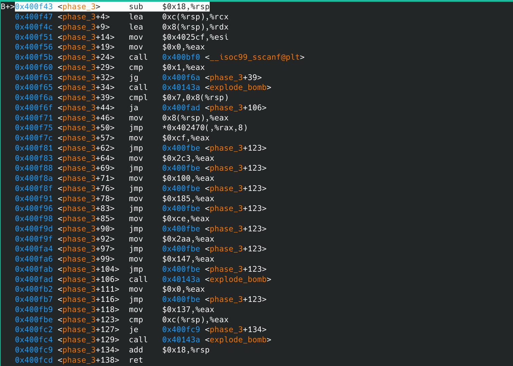

# bomb lab实验记录

## gdb的使用

参考：http://c.biancheng.net/gdb/

在这次实验会用上又比较有意思的：

```
(gdb)layout asm
开启一个汇编窗口，可以更清楚看到执行
(gdb)layout regs
开启一个寄存器窗口，这俩一开其实就有点像DOS box里tcc调试汇编了
(gdb)info break
查看所有断点情况
(gdb)refresh
把窗口重新刷新一下（有可能乱糟糟的）
(gdb)[ctrl+x]再按2可以 以两个窗口形式展示
```

```
(gdb) help x
Examine memory: x/FMT ADDRESS.
ADDRESS is an expression for the memory address to examine.
FMT is a repeat count followed by a format letter and a size letter.
Format letters are o(octal), x(hex), d(decimal), u(unsigned decimal),
  t(binary), f(float), a(address), i(instruction), c(char), s(string)
  and z(hex, zero padded on the left).
Size letters are b(byte), h(halfword), w(word), g(giant, 8 bytes).
The specified number of objects of the specified size are printed
according to the format.  If a negative number is specified, memory is
examined backward from the address.

Defaults for format and size letters are those previously used.
Default count is 1.  Default address is following last thing printed
with this command or "print".

---------

```


## 看bomb.c的组织


从图上还是很容易看出这个炸弹就是先initialize一个炸弹，然后逐一验证六个输入字符串，理所应当的phase_x()就是验证输入的函数了，在gdb里也是以他们为基准设断点

## phase_1



phase_1检验函数的全貌只有上面短短几行，可以猜是用栈传的变量，用string_not_equal比较两个字符串，<phase_1+14>应该是对出口参数（估计是个bool值）判断是否为0,（`test reg1,reg1`只在为`reg1==0`时，设zf为1)

strings_not_equal里边代码还是比较多的，但是我觉得上面猜的应该没错，所以认为不用往里面看了（跑）

可以看到一个比较可疑的是<phase_1+4>这一句，$0x402400应当是个地址，有可能是比较的参数之一，即答案，用gdb的x参数看一下就知道了



ok,答案出来了，试一下，确实是第一个phase

Border relations with Canada have never been better.

## phase_2



phase_2全貌如上

可以看到有个<read_six_numbers>，可以判断是要输入六个数字，在<read_six_numbers>里检测到不是6个数字也会爆炸。

6个数字存在stack里。

简单单步跑了一下应该是带循环的题。一步一步画图跟着跑就行了，答案是

1 2 4 8 16 32

## phase_3



phase_3姑且能完全截图

