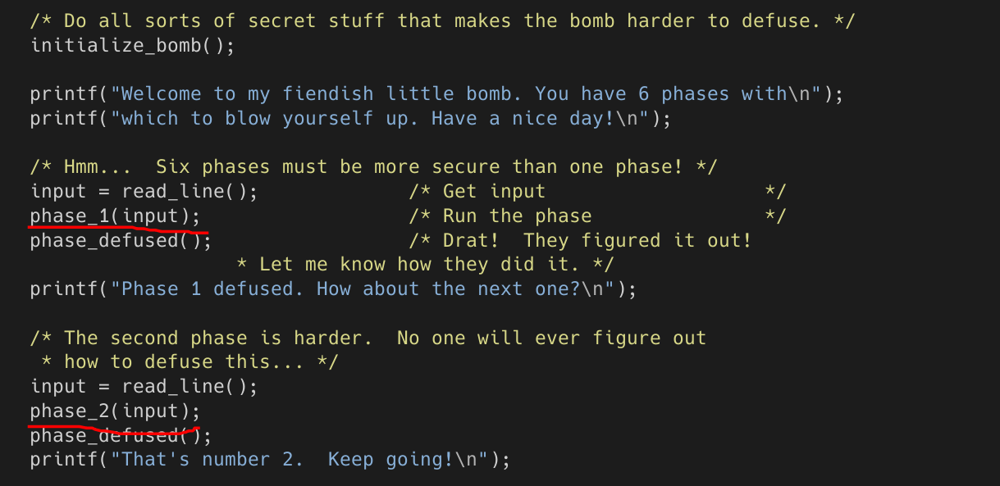
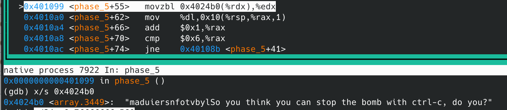

# bomb lab实验记录

## gdb的使用

参考：http://c.biancheng.net/gdb/

在这次实验会用上又比较有意思的：

```
(gdb)layout asm
开启一个汇编窗口，可以更清楚看到执行
(gdb)layout regs
开启一个寄存器窗口，这俩一开其实就有点像DOS box里tcc调试汇编了
(gdb)info break
查看所有断点情况
(gdb)refresh
把窗口重新刷新一下（有可能乱糟糟的）
(gdb)[ctrl+x]再按2可以 以两个窗口形式展示
```

```
(gdb) help x
Examine memory: x/FMT ADDRESS.
ADDRESS is an expression for the memory address to examine.
FMT is a repeat count followed by a format letter and a size letter.
Format letters are o(octal), x(hex), d(decimal), u(unsigned decimal),
  t(binary), f(float), a(address), i(instruction), c(char), s(string)
  and z(hex, zero padded on the left).
Size letters are b(byte), h(halfword), w(word), g(giant, 8 bytes).
The specified number of objects of the specified size are printed
according to the format.  If a negative number is specified, memory is
examined backward from the address.

Defaults for format and size letters are those previously used.
Default count is 1.  Default address is following last thing printed
with this command or "print".

---------

```


## 看bomb.c的组织



从图上还是很容易看出这个炸弹就是先initialize一个炸弹，然后逐一验证六个输入字符串，理所应当的phase_x()就是验证输入的函数了，在gdb里也是以他们为基准设断点

## phase_1


phase_1检验函数的全貌只有上面短短几行，可以猜是用栈传的变量，用string_not_equal比较两个字符串，<phase_1+14>应该是对出口参数（估计是个bool值）判断是否为0,（`test reg1,reg1`只在为`reg1==0`时，设zf为1)

strings_not_equal里边代码还是比较多的，但是我觉得上面猜的应该没错，所以认为不用往里面看了（跑）

可以看到一个比较可疑的是<phase_1+4>这一句，$0x402400应当是个地址，有可能是比较的参数之一，即答案，用gdb的x参数看一下就知道了


ok,答案出来了，试一下，确实是第一个phase

Border relations with Canada have never been better.

## phase_2


phase_2全貌如上

可以看到有个<read_six_numbers>，可以判断是要输入六个数字，在<read_six_numbers>里检测到不是6个数字也会爆炸。

6个数字存在stack里。

简单单步跑了一下应该是带循环的题。一步一步画图跟着跑就行了，答案是

1 2 4 8 16 32

## phase_3


phase_3姑且能完全截图

`x/s 0x4025cf`对应`"%d %d"`

反正就是有两个整数要输入。看样子应该是有多组解的，第一个整数小于8(<phase_3+39>)然后针对不同的第一个整数，在<phase_3+50>里会跳转到不同的相等判断里，我第一个输入的2, 第二个对应的是0x2c3,因此答案是 2 707


## phase_4

phase_4分为两部分，一个func_4,一个phase_4


先看<phase_4>，里面靠前的部分和上一个字符串是一样的处理，要求输入两个整数。(%rsp+8)是第一个，(%rsp+0xc)是第二个整数。

在<phase_4+46>后的三行传递了参数，调用f(edx=14, esi = 0, edi = 第一个整数)，直接往下看，eax是返回值，有(eax != 0)=> bomb!。因此我们要找到合理的第一个整数使func_4返回0。

之后<phase_4+69>判断了第二个整数是否为0，非0爆炸，所以很容易看出第二个整数是0。

看<func_4>，尝试用C风格写出来，写到下图这里就发现猫腻了


还没开始写递归部分，可以发现已经有办法让其返回0了，条件判断里只要ecx==edi就ok了，根据这个函数和前面的参数可以得到edi == 7符合条件，但是应该是有多种解法的，暂时先摸了。

所以答案是7 0

## phase_5

<phase_5>依然能勉强截图下来（


看得出是要输字符串。

里面首先感到陌生的是<phase_5+8>，把`%fs:0x28`赋给了rax，再把rax丢到stack里。这个是对抗缓冲区溢出攻击的手段，%fs:0x28可以得到一个随机整数，放在返回的指令地址(rip)前面，充当stack canary（金丝雀），当stack要溢出时会先覆盖掉该整数再覆盖返回指令地址，在返回前CPU会检查该数是否遭到篡改，把程序给停下来，因此能够对抗缓冲区溢出。

<phase_5+29>判断输入字符串长度，不为6则爆炸。

在<phase_5+81>给出了比较的字符串，是`flyers`，<phase_5+70>和下一行表明有一个执行六次的循环，再看（rsp+0x10）是字符串`uidfys`，盲猜是对我输入的字符串`string`进行了改造，所以目标是发现改造的规律，代码集中在+41到+74之间。



<phase_5+55>里的movzbl是零扩展，把单字节送到右边并用零充高位。
这里0x4024b0得到一串无规则字符串，应该就是转换的密码表，在So前面刚好是16个字母，而rdx经过and 0xf截断后只保留了最后四位刚好。

密码表：maduiersnfotvbyl
f:0x9, l:0xf, y:0xe, e: 0x5, r: 0x6, s: 0x7，所以对着ascii表查，ionefg满足条件（其实应该有很多都满足）

## phase_6

<phase_6>代码又臭又长，放不下，看了很久也没有看透彻，但是大概分成了两部分，前部分是对输入内容的限制，要求是6个数字，1～6且不能重复。

之后有大量对stack的搬运，还有一个很容易看到的数据段


从node1～6可以看到是个16字节的node结构，加上+8是地址，合理怀疑是next_node,所以猜是个链表，左边4个字节是神必数字，所以盲猜是给链表排序（好像确实是这样），猜到这点之后我就没有怎么仔细看实现代码了，实在太长了。在<phase_6+235>到<phase_6+257>这一段可以看出是在按某种顺序比较这几个node的值，先人肉排序node3>node4>node5>node6>node1>node2,然后我试了几个序列，一开始还真按5,6,1,2,3,4填2333，一般排序是给出node序号的吧哈哈哈哈不是按顺序给排位。然后要注意前面有7-i的操作，所以要倒着输入，最后答案是4 3 2 1 6 5


## finish


Fin.

## 隐藏关卡

摸了 不想做。（跑）

