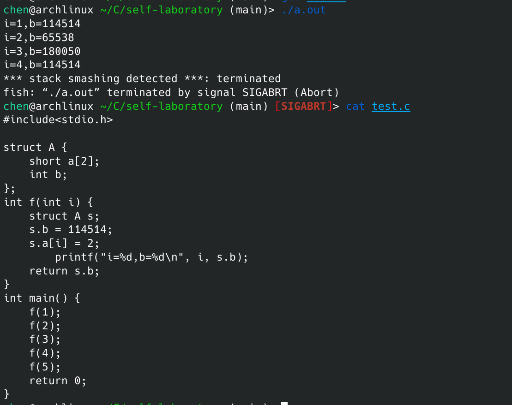
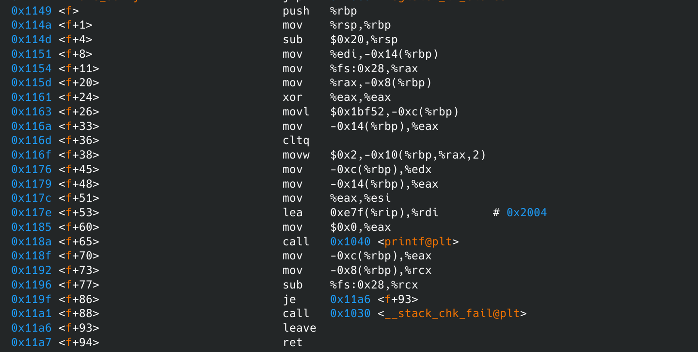

# 第三章 机器层级表示

## 编译指北

（其实只是一些工具用法的归档，并没有self-laboratory这种东西

```
> gcc -Og -S program.c
```

`-S`选项将program.c编译为汇编层级代码，留下test.s文件

```
> gcc -Og -c program.c
```

产生program.o二进制object文件（多个文件连接后才能变成可执行文件）

 ## switch的汇编表示

switch的实现并不是if-else，而是采用类似于哈希表的方式，使用了一个叫jump table的数组来控制跳转到符合要求的code segment地址

## x86-64的内存

64位寻址是2^64,这个数字远超当前需要的内存的范围，64位大概是1.7e9个GB，2048个PB（全google每天会产生几个PB的数据）。

所以日常机器并不需要那么多，机器限制47位寻址，16384个GB，16TB。

所以做bomblab时可以看到栈顶是0x00007fffffffffff就是这样，省略前面四个零，后边一共是47位。常用机器栈是8MB

## buffer overflow

buffer overflow有时称作stack smash




图里可以看出溢出的情况，出现在i=2和i=3，小的溢出覆盖了A结构的b值，大溢出就跳过了，然后会被侦测到。在main函数里只留下会溢出的f(5)



做过bomb lab之后看这种就不是很困难了。edi是参数。可以看到程序预留了0x20的空间(sub $0x20, %rsp)（刚好够用，然后在(%rbp-8)处设置了canary（8bytes）,只要后面越界了就会覆盖，如果太大直接越过canary就不会报错。

## Overflow的保护机制

### ASLR

Adress Space Layout Randomization（地址空间布局随机化），把栈空间随机。

### Nonexecutable code segments

像UNIX权限系统一样，可读可写可执行，使用标记的方式确定某些数据段是不可执行的，就是注入了也无法执行。

### Canary

在bomb lab中可以看到。 就是在分配栈的时候在分配空间的顶部放入%fs:0x28的值，在准备返回上一个函数的stack frame时比较是否发生变化，如果与%fs:0x28的值相同说明没有发生篡改。否则程序报错。


